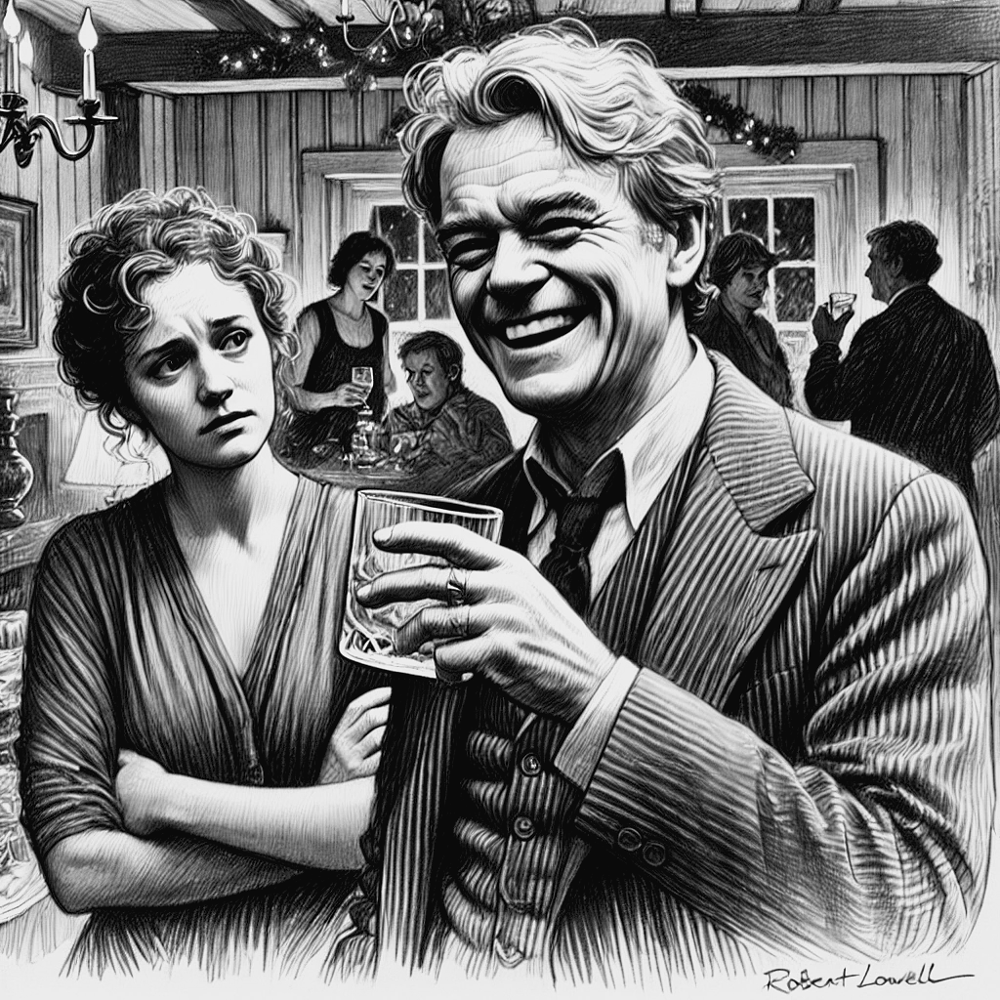

# Bipolaridade

As alterações de humor e de comportamento de Lowell começam na ainda na infância, com uma aparente volatilidade de humor, comportamento desafiador, que evoluíram na juventude para “entusiasmos” intensos, crises de raiva e comportamentos obsessivos. Ao longo de sua segunda década de vida, alternou entre períodos de grande fervor religioso e surtos de raiva. Por volta de terceira década de vida começou a apresentar surtos psicóticos e teve sua primeira internação psiquiátrica [@Jamison2017, pag. 84]. No período de 27 anos, compreendidos entre 1949 a 1976, Lowell passou por cerca de aproximadamente quinze internações devido a crises de mania e uma internação devido a depressão [@Jamison2017, pag. 112-113]. Lowell era um homem complexo, que se tornou ainda mais complicado por uma doença que periodicamente e radicalmente mudava sua personalidade e seu comportamento [@Jamison2017, pag. 207]. Lowell era capaz de ser divertido e preencher o ambiente com sua personalidade; mas quando estava num surto de mania era capaz de horrorizar e humilhar a quem mais amava [@Jamison2017, pag. 209].

Como descreveu Jamison, "Lowell experimentou uma loucura completa, não a versão suavizada de doença mental retratada nos anúncios de empresas farmacêuticas como algo contornável, aceitável e simplificadamente tratável" [@Jamison2017, pag. 212]. Lowell sofria de uma forma severa de bipolaridade. Seus episódios maníacos eram brutais e eram seguidos de depressão, remorso e humilhação [@Jamison2017, pag. 199]. Depois de cada crise, após retomar sua sanidade, seria sempre necessário enfrentar a vergonha do que tinha feito aos familiares, amigos, estudante e colegas; seria necessário lutar para tentar dar sentido a tudo que tinha feito a toda dor que que tinha causado nos outros [@Jamison2017, pag. 200]. Reparar tudo isso era ainda mais difícil devido as depressões que se seguiam aos episódios de mania. Junto com tudo isso, tinha ainda de lidar com a certeza de que novas crises ainda viriam.

O sofrimento e as dificuldades causadas pelo transtorno bipolar, pelas constantes oscilações de humor e, principalmente, pelas crises de mania, foram descritas com precisão por Elizabeth Hardwick, que foi sua esposa por 23 anos. Uma das grandes angústias de Elizabeth era a dificuldade de lidar com os períodos iniciais da mania que, em seus estágios iniciais pode ser “extrovertida, desinibida e infecciosa; seus efeitos precoces e leves podem ser cativantes” [^bipolaridade-1] [@Jamison2017, pag. 119-120]. Hardwick se queixava que, no início dos sintomas, muitos de seus colegas e amigos interpretavam as mudanças e comportamento como uma “mera excentricidade”. A dificuldade de reconhecer a hipomania tornava esse período particularmente difícil. É um período no qual, como descreveu Hardwick, o paciente “tem ainda muito controle, muita habilidade de funcionar, enquanto está ao mesmo tempo extremamente imprudente e descontrolado” [@Jamison2017, pag. 124]. O início da fase de mania pode ser agravável, até que saia do controle [@Jamison2017, pag. 129]. Há nessa fase um receio de acusar alguém de estar doente simplesmente porque está agindo de forma inconveniente. Hardwick disse certa vez, sobre as fases de hipomania de Lowell: “I’m afraid I’ve became a sinistre Goddess of Reason” [@Jamison2017, pag. 124].

[^bipolaridade-1]: extraverting, disinhibiting, and infectious; its early, mild effects can be captivating

Um dos psiquiatras que atendeu Lowell em sua primeira crise de mania, analisando sua história pregressa, concluiu que ele já tinha tido diversos períodos de humor elevado durante os quais se mostrava “hiperativo, com autoconfiança aumentada, falando demais e, por vezes, rude e dominador” [@Jamison2017, pag. 111-112]. Esses períodos duravam cerca de 8 meses, eram sempre períodos de maior produtividade em sua carreira de escritor e eram seguidos de fases de baixa energia e depressão, nas quais não conseguia trabalhar. Mas os sintomas da bipolaridade de Lowell só ficaram evidentes quando teve a primeira crise de mania de 1949, aos 32 anos de idade. Antes disso, suas oscilações de humor não tinham ainda sido reconhecidas como sintomas de um transtorno mental.

Em várias de seus episódios de mania apresentava delírios de grandiosidade, as vezes acreditando ser Dante, outras vezes acreditando ser T. S Elliot, Shakespeare Homero ou até mesmo Napoleão Bonaparte [@Jamison2017, pag. 15-16, 63].
