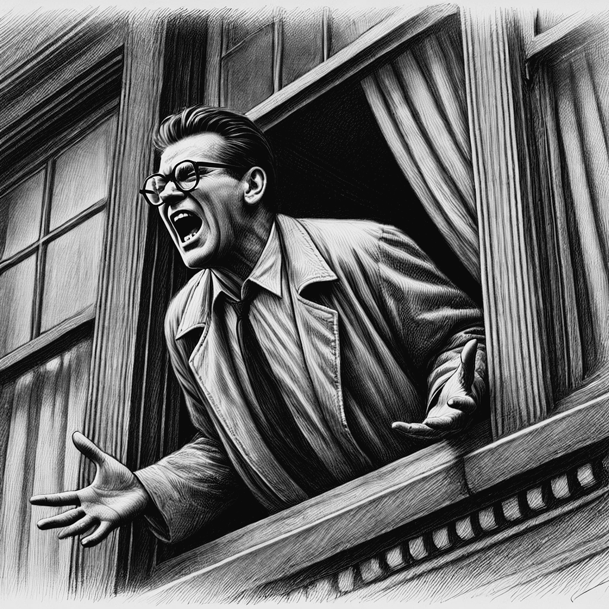
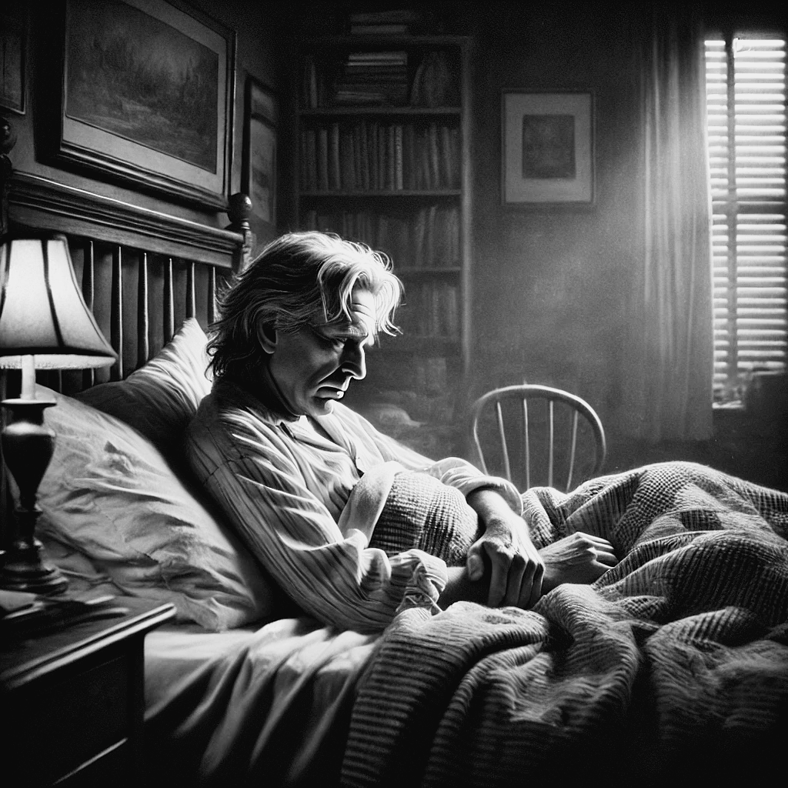
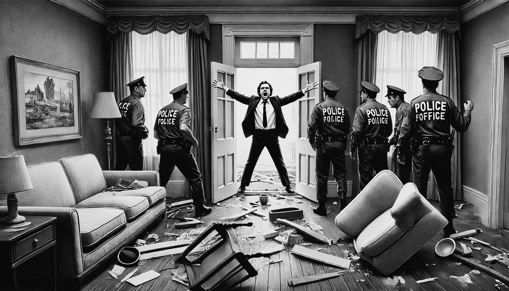
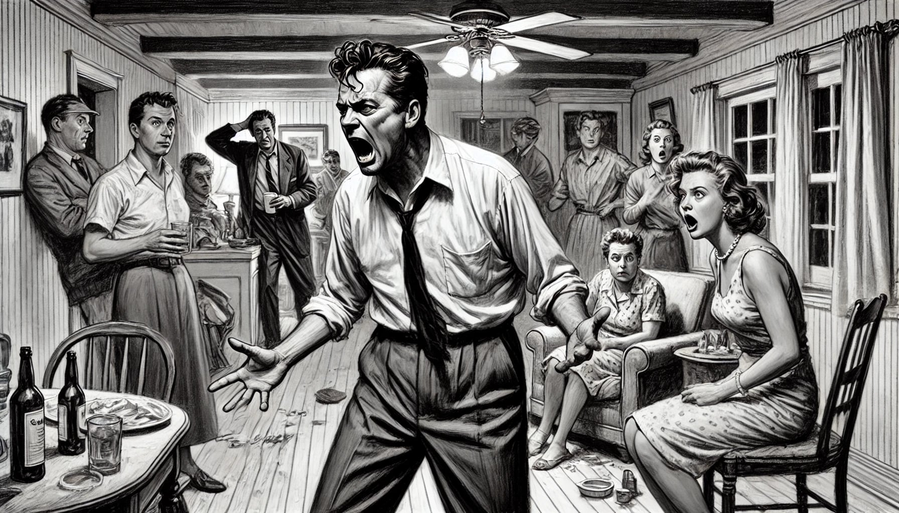
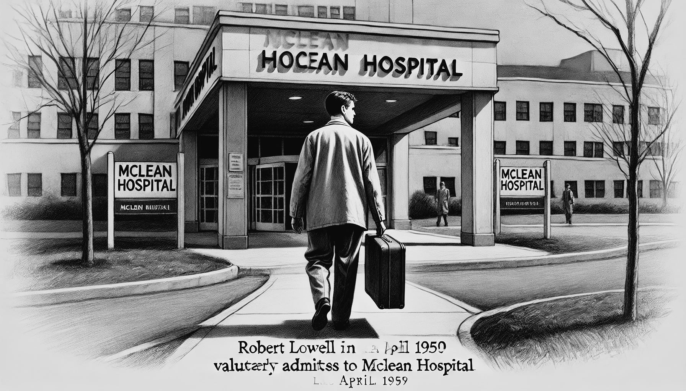
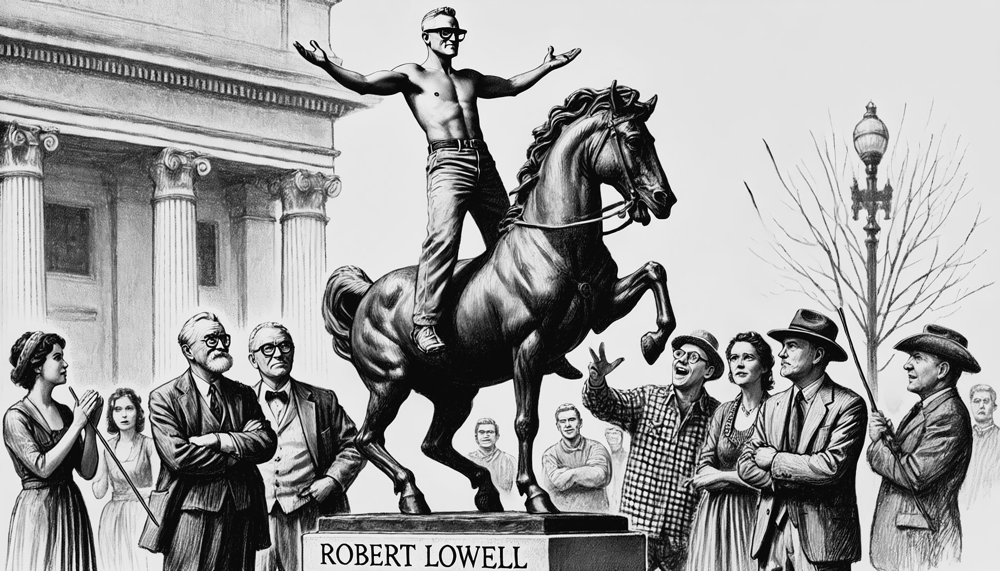

# As Crises

Durante os primeiros 18 anos de sua doença, dos 32 aos 50 anos de idade, Lowell vivenciou inúmeras crises de mania, vivenciou inúmeros episódios psicóticos, foi internado por diversas vezes, foi preso em algumas ocasiões e passou por profundos episódios depressivos. Com o uso do lítio, a partir de 1967, Lowell conseguiu uma certa estabilidade, com muito menos internações, até que teve uma intoxicação pelo Lítio em 1975. A seguir, descrevemos algumas das crises mais marcantes de Lowell, baseado na obra de Kay R. Jamison, "Setting the River on Fire" [@Jamison2017].

```{r}
#| echo: false
#| message: false
#| warning: false
source("code/grafico_internacoes.R")
```

## Abril de 1949, Saratoga Springs, NY



Em outubro de 1948 Lowell se mudou para uma colônia de escritores em Saratoga Springs, para escrever seu poema "*The Mills of Kavanaughs*". Seu primeiro surto de mania começou lentamente no final de desse ano. Lowell começou a abusar de álcool, sua mente começou a se acelerar, sua produção literária aumentou até se desorganizar [@Jamison2017, pag. 98-99]. Em fevereiro de 1949 começou a se preocupar obsessivamente com a influência de comunistas em sua região, evoluindo para um quadro de excitação, exaltação do humor e delírios de cunho místico-religioso. Em seu delírio, Lowell acreditava estar numa missão de purificação e de canonização e que Deus falava através dele. Nessa fase de exaltação e fervor religioso chegou a ficar recluso em um monastério Trapista por cerca de uma semana [@Jamison2017, pag. 99]. A partir daí o quadro se agravou e Lowell entrou num estado fora de controle, evoluindo para um quadro delirante de grandiosidade, de cunho místico e persecutório [@Jamison2017, pag. 99]. Viajou para Chicago e contou a uma amiga que tinha descoberto o segredo do universo, causou problemas num restaurante e, da janela do quarto de seu hotel, começou a gritar obscenidades. Passou a acreditar que estava sendo perseguido por "forças do mal". Voltando para Bloomington, correu pelas ruas da cidade gritando contra demônios e chegou a pensar que era a reencarnação do Espírito Santo. Na Faculdade de Indiana criou um caos ao dizer que o demônio estava escondido em um dos vasos de plantas. Foi em seguida levado pela polícia para cadeia, onde passou uma noite, tendo sido levado para uma clínica psiquiátrica no dia seguinte [@Jamison2017, pag. 102]. Essa seria sua primeira internação, aos 32 anos de idade.

Lowell deu entrada no Balpate Hospital no dia 06 de abril de 1949. Foram cerca de aproximadamente 4 meses de evolução de sua crise, que começou no final de 1948. Lowell, nessa primeira internação, foi descrito como eufórico, excitado, hiperativo, exaltado, e falando sem cessar. Ele disse aos médicos que era indestrutível, que era um mensageiro dos Céus, que havia sido Cristo há pouco tempo, que havia andado sob as águas, que se comunicava regularmente com Deus, que era a reencarnação do Espírito Santo e que havia derrotado as forças do mal. Contou também que tinha tido visões de seres verdes que o assustavam e que não estava dormindo há dias. Em resumo, estava num estado de mania [@Jamison2017, pag. 103].

Sua noiva, Elizabeth Hardwick, contou que os meses que antecederam a internação foram assustadores. Muitos de seus amigos só compreenderam que Lowell estava realmente doente quando ele foi internado. Em junho de 1949, ainda no hospital, Lowell foi tratado com seis sessões de eletroconvulsoterapia (ECT), o único tratamento disponível na época para a mania. Seus delírios e sua agitação melhoraram quase que imediatamente. Entretanto, uma semana depois Lowell entrou num estado depressivo grave. Sentia-se incapaz de escrever, de concentrar, seu pensamento estava lentificado, sentia-se sem energia. Preferia ficar sozinho e teve pensamentos suicidas [@Jamison2017, pag. 104-105]. Lowell recebeu alta no dia 12 de julho de 1949, depois de mais de 3 meses de internação [@Jamison2017, pag. 112].

Ao sair de hospital estava ainda depressivo, se sentindo humilhado por tudo que havia feito durante sua crise de mania. Sentia-se consumido pela culpa e remorso por todo sofrimento que havia causado. Entretanto, apesar dessa depressão, duas semanas depois ele e Elizabeth Hardwick se casaram. Esses primeiros meses de casamento foram marcados pela fase depressiva de Lowell, com sentimentos de abandono, autoacusação e desesperança [@Jamison2017, pag. 108]. Aos poucos depressão de Lowell se agravou, passava dias deitado na cama, sozinho, voltou a ter alucinações, delírios e pensamentos suicidas.

## Setembro de 1949 – Nova York, NY



No dia 13 de setembro de 1949, foi novamente internado numa clínica psiquiátrica [@Jamison2017, p. 108-109, 112]. Essa foi sua segunda internação, dessa vez num estado depressivo grave. Estava lentificado, com dificuldade para se concentrar, com humor deprimido. Sentia-se vazio, sem coragem, passava dias sem conversar. Nessa internação passou vários dias deitado na cama pensando em suicídio. Como não haviam ainda antidepressivos, durante os quase nove meses dessa internação seu tratamento consistiu em psicoterapia, [@Jamison2017, pag. 110]. Lowell recebeu alta no início de janeiro de 1950. Havia perdido quase um ano para a doença, que ainda traria muito sofrimento nas próximas décadas de sua vida.

## Agosto de 1952 - Salzburg, Áustria



No verão de 1952 Lowell e Hardwick viajaram para Salzburg, na Áustria, para uma conferência na qual ele seria um dos palestrantes. Lowell estava eufórico com essa viagem e, diferentemente da primeira crise, evoluiu muito rapidamente para um estado de mania. Tornou-se irritadiço e impulsivo, se apaixonou por uma estudante de música. Certo dia desapareceu do castelo onde estava acontecendo a conferência e foi encontrado vagando na fronteira da Áustria com a Alemanha. Estava falando sem parar por toda noite. O dia de sua internação foi um verdadeiro caos na faculdade, com carros de polícia por todo lado. Lowell estava em seu quarto, com uma aparência selvagem, "carregado de adrenalina". Tinha feito uma barricada em seu quarto e se recusava a sair. Foi levado para internação de forma involuntária, num estado de mania, furioso, falando rápido e de forma incoerente [@Jamison2017, pag. 113-115]. Foi levado inicialmente para o American Army Hospital em Salzburg e depois transferido para o U.S. Army Hospital em Munique, onde foi tratado com seis ou sete sessões de ECT. Sua internação foi bem mais rápida que a primeira, tendo durado menos de um mês. Depois dessa internação Lowell escreveu que "num período de vinte dias passei pelos três estágios da exuberância, confusão e depressão e posso dizer agora que está tudo terminado, sem nenhum sinal de recaída". Lowell minimizava a gravidade de sua crise e tinha um otimismo exagerado com o futuro de sua doença. Sua próxima crise, entretanto, viria mais cedo que ele esperava.

## Abril de 1954 – Cincinnati, Ohio.


Lowell e Hardwick voltaram para os Estados Unidos em 1953 e ele começou a trabalhar na Universidade de Cincinnati. Os sintomas de mania de Lowell surgiram novamente depois da morte de sua mãe em fevereiro de 1954. Apaixonou-se novamente pela mesma estudante de música que conheceu em Salzburg, declarou que queria se separar de Hardwick. Suas aulas aos poucos se tornaram caóticas e psicóticas. Começou a beber de forma abusiva, comprar de forma impulsiva e insultar publicamente os colegas [@Jamison2017, pag. 119-123]. Passou a ter alucinações auditivas e visuais, desagregação do pensamento com fuga de ideias e um comportamento cada vez mais bizarro. Depois de quase um mês de evolução dos sintomas, no início de abril de 1954, foi internado de forma involuntária no Jewish Hospital em Cincinnati. Nessa internação recebeu cerca de vinte sessões de ECT. Entretanto, a recuperação da mania foi incompleta e pouco depois de terminar as sessões de ECT voltou a ficar agitado. Lowell foi transferido para um hospital temporário e, no final de maio de 1954, foi internado no Payne Whitney Clinic em Nova York. No início dessa internação estava um pouco deprimido, mas depois de duas semanas entrou novamente num estado de mania. Tornou-se agressivo, agitado, ansioso, tenso e hostil. Entrou num estado delirante, com delírios de grandiosidade, tendo dito ao seu médico e à equipe de enfermaria que ele era Cristo. Três semanas depois de ter sido internado, foi medicado com clorpromazina pela primeira vez e em 24 horas seu estado melhorou de forma dramática [@Jamison2017, pag. 126-127]. Sua esposa comentou que era a primeira vez nos últimos cinco meses que Lowell estava racional. Lowell recebeu alta em setembro de 1954, depois de mais de cinco meses de internação. Essa melhora, entretanto, tinha seu preço. Lowell se sentia pesado e lentificado. Aos poucos, à medida que melhorava, sua medicação foi então sendo reduzida até ser totalmente retirada.

A carta que Lowell escreveu para uma amiga sobre essa crise é uma descrição valiosa dos altos e baixos da bipolaridade: "*I have been sick again, and somehow even with you I shrink broth from mentioning and not mentioning. These things came on with a gruesome, vulgar, blasting surge of 'enthusiams', one becames a kind of man-aping balloon in a parade – then you subside and eat coffee-grounds of dullness, guilt etc*." [^3-crises-1] [@Jamison2017, pag. 130].

[^3-crises-1]: *Voltei a ficar doente e, de alguma forma, mesmo com você, tremo de mencionar e não mencionar. Essas coisas vieram com uma onda horrível, vulgar, explosiva de "entusiasmos", a pessoa se torna uma espécie de **balão** em um desfile – então você diminui e come borra de café de tédio, culpa etc*

## Dezembro de 1957 – Boston, Massachusetts



O ano de 1957 foi marcante na vida de Lowell. Ao longo desse ano sua energia e entusiasmos foram aumentando gradativamente até culminar numa crise grave de mania no final do ano. Durante vários meses estava dormindo menos, bebendo mais e usando clorpromazina para se acalmar. Durante os meses de Setembro a Outubro de 1957 Lowell foi extremamente produtivo em sua escrita,  tendo escrito vários dos poemas de "Life Studies" [@Jamison2017, p. 135-136, 299]. Lowell, quando nesses períodos de hipomania, sentia que a poesia era mais original, mais radical e "vinha mais facilmente" [@Jamison2017, p. 298]. A escrita incessante, rápida e furiosa era um sintoma de alerta de uma nova crise de mania. Em novembro Lowell já estava num estado de mania e não conseguia mais escrever [@Jamison2017, p. 138]. Estava hiperativo, irritadiço, taquilálico, com fuga de ideias, ameaçador, fazendo inúmeros planos irrealísticos e pensamentos suicidas [@Jamison2017, p. 137]. Em dezembro de 1957 Lowell convidou mais de 40 amigos para uma festa em sua casa, sem nem ao menos avisar sua esposa. A noite foi um caos completo. Lowell abusou de álcool e ofendeu vários de seus convidados. Ao final de três dias e três noites sem dormir o estado de Lowell tinha se agravado consideravelmente. No dia 12 de dezembro de 1957 foi levado pela polícia para internação involuntária no Boston State Hospital [@Jamison2017, p. 136]. Essa era sua quinta internação no período de oito anos [@Jamison2017, pag. 3]. Depois de uma semana sem melhora foi transferido para o Massachusetts Mental Health Center, onde ficou internado até 14 de janeiro de 1958. Mas duas semanas depois de sua alta foi internado novamente num estado de mania para o McLean Hospital em Belmont, onde ficou internado até final de maio de 1958. Foram cerca de 5 meses de internação nessa crise, passando por 3 diferentes hospitais.

## Abril de 1959 – Boston, Massachusetts



No final de abril de 1959, quase um ano depois de sua última crise, Lowell se internou voluntariamente no McLean Hospital. As crises anteriores já tinham sido causado muito sofrimento e ele resolveu se internar para se tratar e evitar passar pelas situações embaraçosas que tinha vivido. Entretanto, em meados de junho, seu estado mental tinha piorado, estava agitado, excitado, com fuga de ideias, querelante, impulsivo. Sua internação foi então alterada para involuntária. Foram quase 3 meses de internação.

## Março de 1961, Nova York, NY

No início de 1961, pouco depois de se mudar para Nova York, Lowell começou num novo episódio de mania. Começou um romance com um jovem poeta, declarou mais uma vez estar se divorciando de sua esposa Elizabeth Hardwick e que iria começar uma nova vida. Foi admitido para internação no Columbia Presbyterian Hospital em março de 1961, onde permaneceu por cerca de quase um mês. Esses comportamentos românticos extraconjugais eram recorrentes nas crises de mania de Lowell e traziam um fardo a mais para sua esposa.

## Agosto de 1962, Argentina



Em agosto de 1962, numa viagem para a Argentina, Lowell entrou novamente num estado de mania. Começou a beber de forma exagerada, falar sem parar, e passou a não dormir. Interrompeu o uso de seus medicamentos, tornou-se desinibido, com sentimentos de grandiosidade, energizado e agitado. Insistia em comprar presentes caros para todos, mandou telegramas para o Papa e para o ex-presidente Eisenhower alegando que a América era o novo Império Romano. Passou acreditar que era o César da Argentina. Insultou publicamente o general que estava prestes a ser nomeado presidente na Argentina. Seu discurso aos poucos foi ficando fragmentado e desconexo. Nas praças da Argentina, Lowell se despiu a subiu em estátuas equinas para "cavalgar ao lado dos generais". Foram necessários seis homens para conter Lowell, que teve de ser contido com uma camisa de força e para ser levado para a Clínica de Bethlehem em Buenos Aires [@Jamison2017, pag. 151].

## Dezembro de 1963, Hartford, CT

Lowell foi mais uma vez internado, num quadro de mania, de dezembro1963 até meados de janeiro de 1964.

## Janeiro de 1965, Hartford, CT

No final de 1964 Lowell estava novamente num quadro de mania, tendo sido internado no dia 1º de janeiro de 1965.

## Dezembro de 1966


Os sintomas de mania de Lowell começaram a ficar novamente evidentes em setembro de 1966. Lowell começou a ter insônia, gastar dinheiro de forma exagerada, suas aulas na universidade, se tornaram caóticas. Apaixonou-se novamente por uma amiga. Passou a fazer comentários agressivos sobre seus amigos, e aos poucos se tornou delirante, passando a acreditar que era o Rei James IV, Napoleão Hitler e até mesmo um messias judaico. Entrou no Metropolitan Opera e tentou conduzir a orquestra. Lowell mais uma vez precisou ser internado. Na véspera de Natal de 1966 cerca de 8 policiais foram a casa de Lowell para levá-lo para uma internação. Lowell arremessou uma garrafa de leite nos policiais, mas depois aceitou ser internado desde que os policiais aceitassem que ouvi-lo recitar um poema. A esposa de Lowell conseguiu convencer os policiais e todos ouviram Lowell recitar o poema "Waking in the Blue". Foi depois levado para o Hospital McLean onde foi internado de forma involuntária por quase três meses [@Jamison2017, pag. 154-155].
