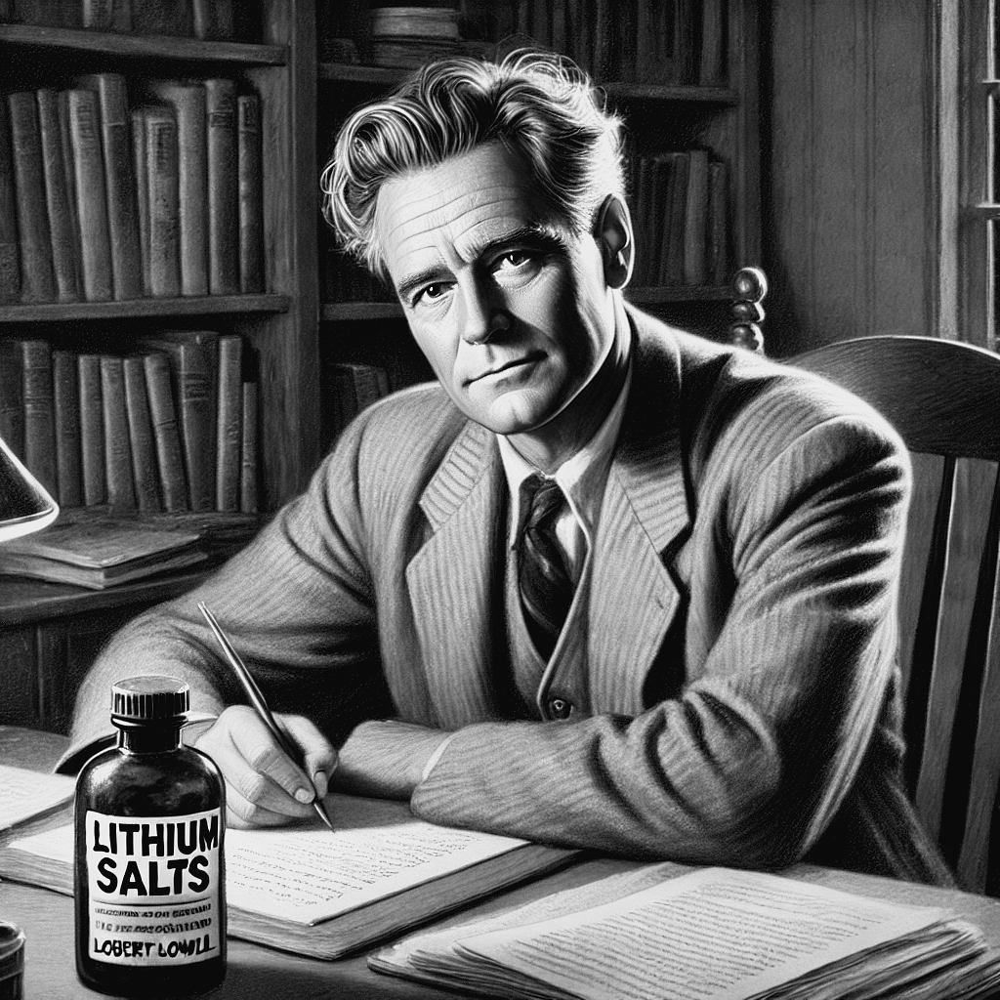

# A Estabilidade

## O início do lítio e estabilidade

Lowell começou usar o lítio por volta de 1967 [@Jamison2017, pag. 178]. Sua primeira internação tinha sido há 18 anos atrás, em 1949, no mesmo ano em que John Cade publicou seu artigo seminal “*Lithium Salts for Psychotic Excitment*” no Medical Journal of Austrália [@Cade1949]. Apesar dessa coincidência, passaram-se quase duas décadas até que Lowell fosse finalmente medicado com lítio [@Jamison2017, pag. 167].

A trajetória aceitação do lítio como um tratamento para os transtornos de humor foi longa e difícil. Umas das primeiras referências do seu uso na profilaxia da depressão foi no século 19, mais precisamente em 1849, quando o psiquiatra Dinamarquês Frederik Lange relatou seus efeitos em 35 pacientes com depressão melancólica [@Shorter2009]. Mas o uso do lítio permaneceu esquecido até meados do século XX, quando foi redescoberto por John Cade. O estudo de Cade suscitou um novo interesse e em 1951 novos estudos na Austrália e na França trouxeram mais evidências de seu potencial terapêutico na mania [@Despinoy1951, @Noack1951]. Mas o artigo que realmente marcou o início do uso do lítio no tratamento da mania e na profilaxia das oscilações da bipolaridade foi o ensaio randomizado de Schou em 1954, que teve um grande impacto na comunidade médica [@Baastrup1967]. Os Estados Unidos (EUA), entretanto, foram mais lentos na adoção do lítio. O interesse pelos sais de lítio nos EUA começou apenas no início da década de 1960 e aos poucos foi se construindo uma cultura de uso “*underground*” do lítio, mesmo sem aprovação de seu uso pelo FDA, o que só aconteceu em 1970. Os Estados Unidos foi 50º país a admitir o lítio no mercado e até hoje é dos poucos países em que o uso de outros estabilizadores, tais como valproato, são usados com mais frequência do que o lítio [@Shorter2009].

Essa demora na aceitação do lítio pela psiquiatria norte americana talvez explique por que Lowell só começou usá-lo por volta do início de 1967, mais de 18 anos depois de lutar contra suas oscilações de humor [@Jamison2017, pag. 178]. O uso do lítio reduziu drasticamente suas internações. Em junho daquele ano, ele escreveu para outro amigo: "Estou em ótima forma! Eu até tenho pílulas que deveriam prevenir ataques maníacos... que supre alguma falta de sal em alguma parte obscura do cérebro." Um ano depois de tomar lítio pela primeira vez, ele escreveu a Bishop novamente: "*Sim, estou bem. Os comprimidos que estou tomando realmente parecem prevenir a mania. Normalmente, eu certamente já estaria em um hospital. Minha vida bem mudou muito, pois eu antes corria o risco de cair a cada passo que dava. Toda a psiquiatria e terapia que tive, quase 19 anos, foi tão irrelevante quanto seria para uma perna quebrada. Bem, parte disso era interessante, a maioria era jargão*" [@Jamison2017, pag. 179]. Um de seus amigos chegou a comentar que "*este foi o primeiro ano em dezoito que ele não teve uma crise. Foram cerca de quatorze ou quinze crises nos últimos dezoito anos. Humilhação e desperdício assustadores. \[...\] Seu rosto parecia mais liso, o peso dos ataques de angústia e da expectativa desapareceram*" [@Jamison2017].

Apesar de Lowell ter vivido 18 anos com a doença sem tratamento farmacológico adequado, ainda assim a resposta ao lítio foi favorável. Alguns trabalhos mostram que a demora no tratamento não reduz a efetividade do lítio [@Baethge2003]. Além disso, a reposta ao lítio parece ser maior nos pacientes mais graves quando comparados aqueles com quadros mais leves [@Baethge2003]. De qualquer forma, iniciar o tratamento mais precocemente certamente beneficiaria Lowell, reduzindo a carga de sua doença tanto nele quantos nos familiares, amigos e sociedade. A mensagem é que é sempre melhor tratar precocemente, mas nunca é tarde para começarmos o tratamento [@Baethge2003].

Entretanto, ficar livre da mania não é suficiente. Lowell continuou abusando de tabaco e álcool e ainda tinha frequentes, porém menos intensos, oscilações de humor. Uma amiga chegou a comentar que ele parecia estar sempre como numa “euforia silenciosa” [@Jamison2017, pag. 182]. Sem seus ataques de mania, a produtividade literária de Lowell até aumentou, entretanto, talvez de uma forma diferente. Lowell viveu mais 10 anos depois de iniciar o lítio, que ajudou a conter seus maníacos até por volta de 1975, quando ele deixou de fazer uso regular da medicação [@Jamison2017, pag. 184].
