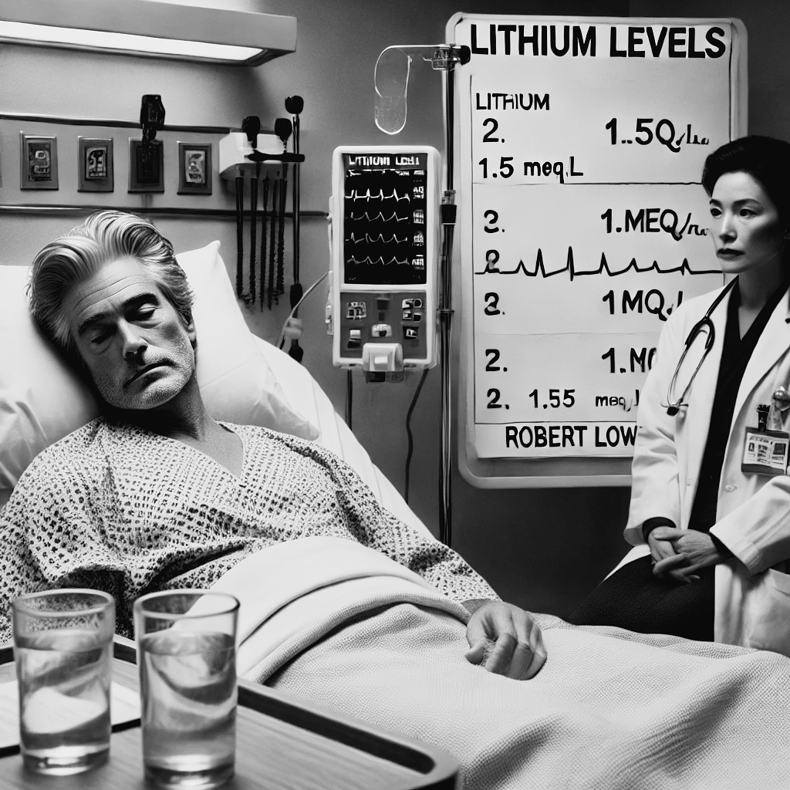

# Últimos anos

Desde que começou usar o lítio, Lowell foi internado passou apenas por uma breve internação em 1970. Mas depois de 1975, até sua morte em 1977, as crises de Lowell voltaram a atormentar sua vida. Em maio de 1975 Lowell teve de ser internado devido a uma intoxicação por lítio. Ele tinha aumentado sua dose de 5 para 8 comprimidos por dia. Seu nível sérico de lítio subiu para 1.5 mEq/L. Lowell foi internado num quadro de delirium e sua dose de lítio foi reduzida abruptamente. [@Jamison2017, pag. 183] Daí em diante suas oscilações pioraram e passou por várias internações nos anos de 1975 e 1976. Em fevereiro de 1976, um ano e meio antes de morrer, Lowell escreveu estar “sobrecarregado com a nova frequência de ataques”, e sentia-se incapaz de funcionar “com dois ataques maníacos em um ano” [@Jamison2017, pag. 176]

Lowell faleceu em 12 de setembro de 1977, em Nova Iorque, aos 60 anos de idade.
