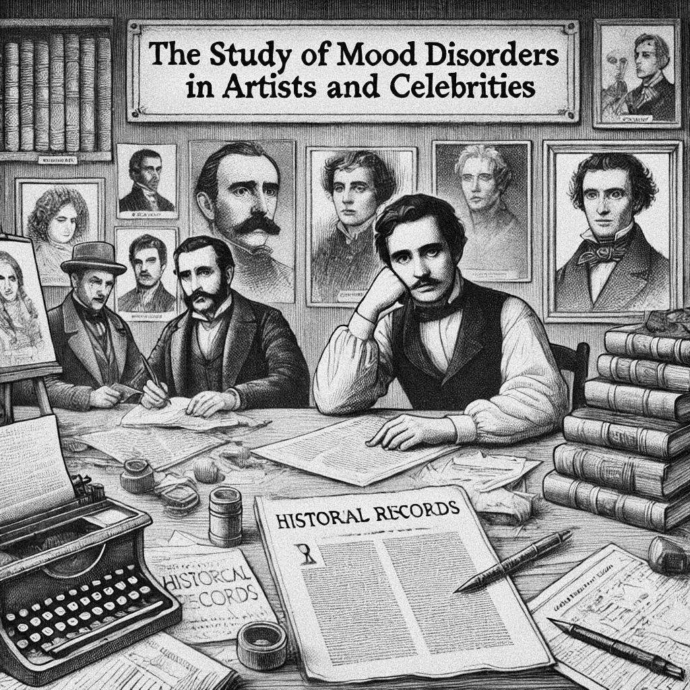

# Introdução

O estudo de casos clínicos tem sido um pilar fundamental no ensino da psiquiatria, proporcionando uma compreensão profunda das diversas facetas dos transtornos mentais. O estudo da evolução e da história natural das alternâncias de humor em artistas e celebridades é interessante para a psiquiatria e psicologia, pois o registro histórico desses personagens é muitas vezes detalhado o suficiente para uma análise aprofundada dos processos da doença. No caso de escritores, esses detalhes são possivelmente mais ricos, ainda mais quando o próprio escritor, com toda sua arte, consegue descrever com precisão e maestria seu próprio sofrimento.

Entre esses, a história de Robert Lowell, um poeta do século XX, se destaca como um exemplo fascinante para explorar a complexidade e os desafios inerentes ao transtorno bipolar. A vida de Lowell, marcada por episódios maníacos intensos, oferece uma perspectiva única sobre como a mania pode influenciar e ser influenciada por aspectos criativos, intelectuais e pessoais de um indivíduo. A biografia das crises de Lowell podem trazer importantes insights não apenas sobre os sintomas das crises, mas também trazem reflexões valiosas sobre o impacto das crises mesmo depois que o paciente se recupera, sobre o desgaste das relações que precisam ser restauradas e sobre o peso de conviver com uma doença tão dramática. Robert Lowell tinha verdadeiro horror da loucura, da incapacidade de controlar as crises e sentimentos frequentes de vergonha e humilhação pelas coisas que tinha feito durante as crises [@Jamison2017, pag. 129].

Ao estudar a trajetória de Lowell, os estudantes de psiquiatria ganham não apenas insights sobre os sintomas do transtorno bipolar, as consequências desastrosas das oscilações de humor nas relações interpessoais, as dificuldades do tratamento, mas também sobre a interação entre o humor e genialidade criativa. Lowell, com sua vida extraordinariamente documentada e sua habilidade de expressar poeticamente suas experiências internas, proporciona um caso rico em detalhes e nuances. Seus poemas e a história de sua vida, repleta de altos e baixos emocionais, servem como um recurso inestimável para entender a natureza dinâmica da mania.

A importância de Lowell no ensino da psiquiatria vai além do estudo clínico de um transtorno. Ele personifica a interseção entre a criatividade artística e a psicopatologia, desafiando os estudantes a contemplar as maneiras complexas pelas quais a mente humana pode manifestar tanto genialidade quanto vulnerabilidade. A análise do caso de Lowell permite uma discussão mais ampla sobre ética, empatia e a abordagem humanizada necessária no tratamento de transtornos mentais.

A história da bipolaridade de Lowell foi descrita de forma brilhante e detalhada na obra “*Robert Lowell. Setting the River on Fire: A Study of Genius, Mania and Character*” de Kay Redfield Jamison, psicóloga e escritora norte americana, que foi a fonte principal desse manuscrito. Entretanto, para fins de ensino da psiquiatria, é necessária uma versão mais condensada da história.
